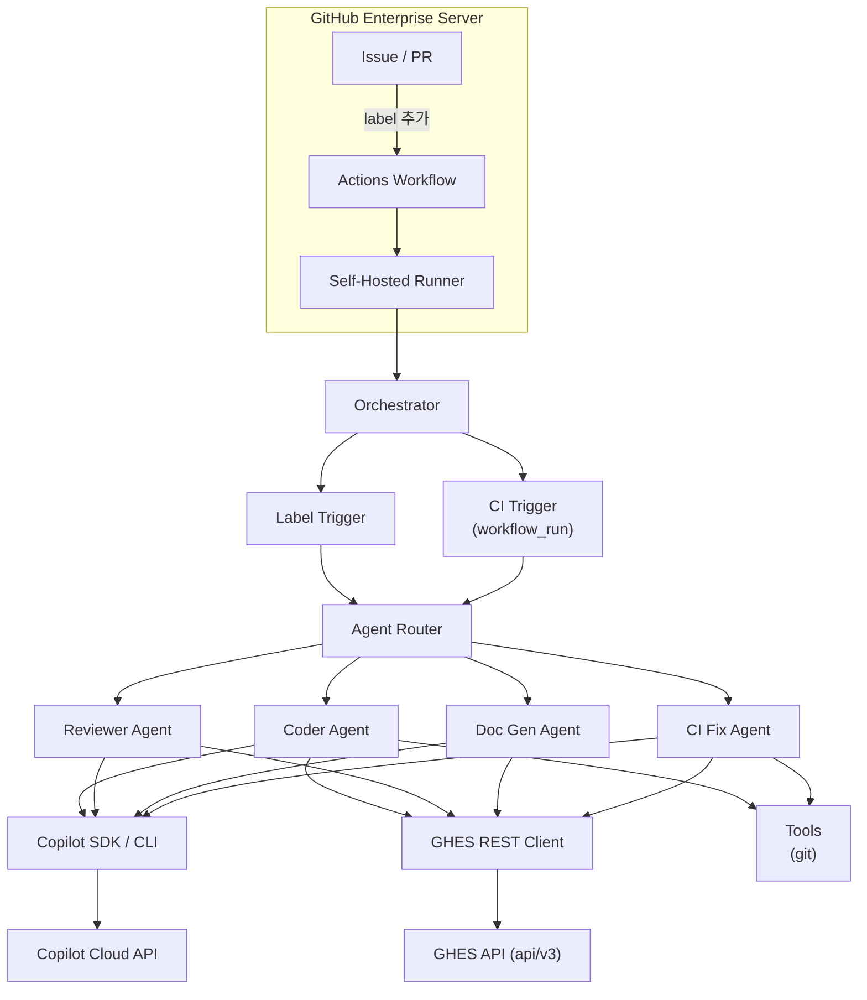

# Copilot SDK sample — Coding-agent-ish implementation on GHES 

> **이 프로젝트는 GitHub 또는 GitHub Enterprise Server의 공식 기능이 아닙니다.**
> [Copilot SDK](https://github.com/github/copilot-sdk)를 활용하여 GHES 환경에서 자율 코딩 에이전트를 구현하는 방법을 보여주는 예제 프로젝트입니다. 프로덕션 환경에 적용하기 전에 충분한 검토와 테스트를 권장합니다.

### [English version available here (README in English)](docs/README.en.md)

[](https://www.python.org/downloads/)
[](LICENSE)


> **Copilot SDK로 만들어 보는 GitHub Enterprise Server에서도 동작하는 코딩 에이전트**
>
> Copilot SDK를 이용하여 우리 애플리케이션에 Copilot의 기능을 추가할 수 있습니다! :) 
> 이슈나 PR에 레이블을 추가하면, AI가 코드를 분석·구현하고 PR을 생성합니다.

### 데모 영상

[](https://www.youtube.com/watch?v=TaKR7z9ynIc)

---

## Features (주요 기능)

| 기능 | 설명 | 트리거 |
|------|------|--------|
| **Coder Agent** | 이슈를 분석하고 코드를 구현해 PR 생성, 경량 모델로 PR 요약 작성 | `copilot` 레이블 |
| **Multi-Model Reviewer** | 동일 조건 다중 모델 교차검증 + 인라인 Suggested Changes | `copilot-review` 레이블 |
| **Doc Generator** | PR 변경 파일을 anchor로 삼거나 전체 workspace를 점검해 문서 업데이트 | `copilot-docs` 레이블 |
| **CI Fix Agent** | CI 실패를 진단하고 수정 | `copilot-fix` 레이블 / `copilot/` 브랜치 CI 실패 시 자동 |

### 반복형 코드 리뷰 (Iterative Review Loop)

```
PR에 copilot-review 레이블 추가
    ↓
Claude + GPT-5.4가 같은 조건으로 전체 범위 독립 리뷰
    ↓
개별 리뷰 + 합의/불일치 요약 + 인라인 Suggested Changes 게시
    ↓
개발자: suggestion 적용 후 copilot-review 레이블 재추가
    ↓
이전 리뷰 컨텍스트 로드 → 미해결 항목 중심 재리뷰
```

**핵심 기능:**
- **GitHub Suggested Changes**: PR에서 "Apply suggestion" 버튼으로 바로 코드 수정 적용
- **컨텍스트 체이닝**: 이전 리뷰 요약을 자동 저장/로드하여 재리뷰 시 일관성 유지
- **프로젝트 리뷰 규칙**: `.github/review-instructions.md`에 팀 규칙 정의 가능

---

## Quick Start (빠른 시작)

### 1. 중앙 리포지토리 설정

```bash
# GitHub.com 원본을 클론한 뒤 GHES 중앙 리포지토리로 push
git clone https://github.com/Heegene/copilot-sdk-coding-agent-sample.git
cd copilot-sdk-coding-agent-sample
git remote set-url origin https://ghes.example.com/YOUR_GHES_ORG/copilot-sdk-coding-agent-sample.git
git push -u origin main
```

### 2. 시크릿 구성

Repository Settings → Secrets and variables → Actions:

| Secret | Required | 설명 |
|--------|----------|------|
| `GH_TOKEN` | Yes | GHES PAT (`repo` scope; 필요 시 `workflow`) — GHES API 및 git 인증 |
| `COPILOT_GITHUB_TOKEN` | No | Copilot SDK 인증용 GitHub 토큰. 미설정 시 러너의 `copilot login` 사용 |

### Authentication (인증 모델)

GHES API와 Copilot SDK는 **별도의 자격증명**을 사용할 수 있습니다:

| 시나리오 | 필요한 시크릿 | 설명 |
|---------|-------------|------|
| **Separate Copilot auth** | `GH_TOKEN` + `COPILOT_GITHUB_TOKEN` | GHES API와 Copilot SDK 토큰을 모두 시크릿으로 주입 |
| **Pre-authenticated runner** | `GH_TOKEN`만 | Runner에서 `copilot login`으로 사전 인증 |

> `COPILOT_GITHUB_TOKEN`은 Copilot SDK의 **공식** 환경변수입니다 (최우선 순위).
> 미설정 시 SDK/CLI는 runner에 저장된 `copilot login` 자격증명을 사용해야 합니다. `GH_TOKEN`은 GHES API 및 git 인증 전용입니다.

### 토큰 발급 가이드

#### A. `GH_TOKEN` — GHES 인스턴스 PAT

GHES API (이슈, PR, git 등) 접근용 토큰입니다.

1. GHES 인스턴스 접속: `https://ghes.example.com/settings/tokens`
2. **Generate new token** → **Classic** 선택 (GHES는 Classic PAT 권장)
3. 필요한 scopes 선택:

   | Scope | 필수 | 용도 |
   |-------|------|------|
   | `repo` | Yes | 레포지토리 읽기/쓰기, PR 생성 |
    | `workflow` | 조건부 | 설치 스크립트처럼 `.github/workflows/*` 파일을 생성/수정할 때 필요. 일반적인 agent 런타임에는 불필요 |

4. 토큰 생성 후 GHES 리포지토리 시크릿에 `GH_TOKEN`으로 저장

#### B. `COPILOT_GITHUB_TOKEN` — Copilot SDK 인증용 (선택)

Copilot SDK/CLI가 AI 모델에 접근하기 위한 토큰입니다.
**Copilot 라이선스가 있는 사용자 계정**에서 발급해야 합니다.

> **Classic PAT (`ghp_`)는 지원되지 않습니다.** Copilot SDK는 Fine-grained PAT (`github_pat_`) 또는 OAuth 토큰 (`gho_`, `ghu_`)만 지원합니다.

**Fine-grained PAT 발급 방법:**

1. **GitHub.com** 접속 (GHES가 아님): `https://github.com/settings/personal-access-tokens/new`
2. **Token name**: 예) `ghes-copilot-agent`
3. **Expiration**: 적절한 만료기간 설정 (보안을 위해 90일 권장)
4. **Repository access**: `Public repositories (read-only)` 또는 필요한 최소 범위
5. **Permissions** 설정:

   | Permission | Access | 필수 | 용도 |
   |------------|--------|------|------|
   | **Copilot** | `Read` | Yes | Copilot API 요청 (모델 호출) |
   | **Contents** | `Read` | No | 코드 컨텍스트 분석 (선택) |

6. **Generate token** → `github_pat_` 으로 시작하는 토큰 복사
7. GHES 리포지토리 시크릿에 `COPILOT_GITHUB_TOKEN`으로 저장

**지원되는 토큰 타입:**

| 토큰 프리픽스 | 타입 | Copilot 지원 |
|-------------|------|-------------|
| `github_pat_` | Fine-grained PAT | 지원 (권장) |
| `gho_` | OAuth user access token | 지원 |
| `ghu_` | GitHub App user token | 지원 |
| `ghp_` | Classic PAT | **미지원** |

**대안: `copilot login` (Runner 사전 인증)**

```bash
# Self-hosted runner에서 1회 실행
copilot login
# 브라우저에서 GitHub OAuth 인증 → 자격증명이 시스템 키체인에 저장됨
```

**SDK 인증 우선순위 ([공식 문서](https://github.com/github/copilot-sdk/blob/main/docs/auth/index.md) 기준):**

```
1. 명시적 github_token (코드에서 직접 전달)
2. COPILOT_GITHUB_TOKEN 환경변수
3. GH_TOKEN 환경변수
4. GITHUB_TOKEN 환경변수
5. copilot login으로 저장된 OAuth 자격증명
6. gh auth login으로 저장된 자격증명
```

### 3. Runner 설정

```bash
sudo ./scripts/setup-runner.sh
```

### 4. 대상 리포지토리에 배포

```bash
# Caller 모드 (org에서 reusable workflow 접근 허용 필요)
./scripts/deploy-to-repo.sh ghes.example.com YOUR_GHES_ORG target-repo "$GH_TOKEN" copilot-sdk-coding-agent-sample

# Standalone 모드 (cross-repo 설정 불필요, 권장)
./scripts/deploy-to-repo.sh ghes.example.com YOUR_GHES_ORG target-repo "$GH_TOKEN" copilot-sdk-coding-agent-sample --standalone
```

> **Caller vs Standalone**: Caller 모드는 중앙 레포의 workflow를 참조하므로 업데이트가 자동 반영됩니다.
> Standalone 모드는 workflow를 직접 복사하므로 GHES org 설정 변경 없이 동작합니다.
> Caller 모드를 쓰려면 중앙 레포 Settings → Actions → General → Access에서 "Accessible from repositories in the organization" 활성화가 필요합니다.

### 5. 테스트!

1. 대상 리포지토리에 이슈 생성
2. `copilot` 레이블 추가
3. AI가 PR을 생성합니다!

> 자세한 설정 가이드: [docs/SETUP.md](docs/SETUP.md)

---

## Architecture (아키텍처)



> 상세 아키텍처: [docs/ARCHITECTURE.md](docs/ARCHITECTURE.md)

---

## Trigger Reference (트리거 레퍼런스)

### Label Triggers (레이블)

| 레이블 | 대상 | 에이전트 | 동작 |
|--------|------|---------|------|
| `copilot` | Issue | Coder | 이슈 분석 → 코드 생성 → PR |
| `copilot-review` | PR | Reviewer | 다중 모델 코드 리뷰 |
| `copilot-docs` | Issue/PR | Doc Gen | PR 관련 문서 업데이트 또는 전체 리포지토리 문서 점검 |
| `copilot-fix` | Issue/PR | CI Fix | CI 실패 진단 및 수정 |

### Auto Triggers (자동)

| 조건 | 에이전트 | 동작 |
|------|---------|------|
| `copilot/` 브랜치에서 CI 실패 | CI Fix | 실패 로그 분석 → 자동 수정 커밋 |

---

## Multi-Model Review (다중 모델 리뷰)

두 AI 모델이 같은 PR diff, 변경 파일 anchor, 파일 컨텍스트, 리뷰 기준을 보고 전체 범위를 독립적으로 리뷰합니다. 변경 파일은 리뷰의 시작점이며, Copilot workspace tools로 관련 호출자, 테스트, 설정, 문서, public API 경계까지 확인할 수 있습니다. 각 모델에는 강점 영역을 더 깊게 보도록 가중치만 다르게 주고, 결과를 통합해 합의/불일치를 분석합니다:

```
PR에 copilot-review 레이블 추가
         │
            ├──▶ Claude: 전체 범위 리뷰 + 보안/아키텍처/유지보수성 강조
         │
            ├──▶ GPT-5.4: 전체 범위 리뷰 + 버그/성능/엣지케이스 강조
         │
            ├──▶ 통합 요약 (중복 제거, 합의/불일치 분석, 최종 판단)
         │
         └──▶ 인라인 Suggested Changes
                  (valid PR diff 라인에서만 "Apply suggestion" 가능)
```

**재리뷰 시**: `copilot-review` 레이블을 재추가하면 이전 리뷰 컨텍스트를 자동 로드하여 미해결 항목 중심으로 리뷰합니다.

---

## Configuration Reference (설정 레퍼런스)

모든 설정은 환경변수 또는 `.env` 파일로 관리됩니다.

### GHES 연결

| 환경변수 | 기본값 | 설명 |
|---------|--------|------|
| `GITHUB_SERVER_URL` | `https://github.com` | GHES 인스턴스 URL |
| `GH_TOKEN` | — | GHES PAT (GHES API 및 git 인증) |
| `COPILOT_GITHUB_TOKEN` | — (옵션) | Copilot SDK 인증용 토큰 |

### Copilot 설정

| 환경변수 | 기본값 | 설명 |
|---------|--------|------|
| `COPILOT_CODER_MODEL` | `claude-sonnet-4.6` | 코드 생성 모델 |
| `COPILOT_CODER_PR_SUMMARY_MODEL` | `gpt-5.4-mini` | 생성된 PR 본문 요약용 경량 모델 |
| `COPILOT_REVIEWER_MODELS` | `claude-opus-4.6,gpt-5.4` | 리뷰 모델 (쉼표 구분) |
| `COPILOT_REVIEWER_SUMMARY_MODEL` | 첫 번째 리뷰 모델 | 다중 모델 리뷰 결과를 통합하는 모델 |
| `COPILOT_REVIEWER_SUGGESTION_MODEL` | 통합 요약 모델 | 채택된 finding을 inline Suggested Changes 형식으로 변환하는 모델 |
| `COPILOT_CLI_VERSION` | `latest` | Copilot CLI 버전 |

### Agent 동작

| 환경변수 | 기본값 | 설명 |
|---------|--------|------|
| `AGENT_TIMEOUT_MINUTES` | `30` | 에이전트 최대 실행 시간 |
| `AGENT_MAX_RETRIES` | `3` | 재시도 횟수 |
| `AGENT_BRANCH_PREFIX` | `copilot/` | 생성 브랜치 접두사 |
| `AGENT_DEFAULT_BRANCH` | `main` | PR 생성 시 base 브랜치 이름 |

### 동시성 제어

| 설정 | 값 | 설명 |
|------|-----|------|
| `MAX_CONCURRENT_SESSIONS` | `5` (코드 상수) | 단일 프로세스 내 Copilot API 동시 세션 수 제한 (`agent/copilot_session.py`) |
| Actions 동시성 그룹 | 워크플로우별 | 동일 이슈/PR에 대한 중복 워크플로우 실행 방지 |

---

## Project Structure (프로젝트 구조)

```
copilot-sdk-coding-agent-sample/
├── agent/                      # 메인 에이전트 패키지
│   ├── orchestrator.py         # 진입점, 이벤트 라우터
│   ├── config.py               # pydantic-settings 설정
│   ├── copilot_session.py      # Copilot SDK/CLI 세션 관리
│   ├── ghes_client.py          # GHES REST API 클라이언트
│   ├── agents/                 # 에이전트 구현
│   │   ├── coder_agent.py      # 코더 에이전트
│   │   ├── reviewer_agent.py   # 리뷰어 에이전트 (멀티모델 + suggestions)
│   │   ├── ci_fix_agent.py     # CI 수정 에이전트
│   │   └── doc_gen_agent.py    # 문서 생성 에이전트
│   ├── triggers/               # 트리거 핸들러
│   │   └── label_trigger.py    # 레이블 기반 트리거
│   ├── tools/                  # 에이전트 도구
│   │   └── git_tools.py        # Git 작업 (async subprocess)
│   └── utils/                  # 유틸리티
│       ├── prompts.py          # Jinja2 프롬프트 템플릿
│       └── suggestions.py      # GitHub Suggested Changes 포맷터
├── scripts/                    # 배포 및 설정 스크립트
│   ├── setup-runner.sh         # Runner 환경 설정 (Python, Node, Copilot CLI)
│   ├── deploy-to-repo.sh       # 워크플로우 배포 (Bash, --standalone 지원)
│   └── deploy-to-repo.ps1      # 워크플로우 배포 (PowerShell)
├── docs/                       # 문서
│   ├── SETUP.md                # 설치 가이드
│   └── ARCHITECTURE.md         # 아키텍처 문서
├── tests/                      # pytest 테스트
├── .github/
│   ├── workflows/              # GitHub Actions 워크플로우
│   │   ├── copilot-coder-master.yml      # 코더 에이전트 (master)
│   │   ├── copilot-coder.yml             # 코더 에이전트 (caller)
│   │   ├── copilot-reviewer-master.yml   # 리뷰어 에이전트 (master)
│   │   ├── copilot-reviewer.yml          # 리뷰어 에이전트 (caller)
│   │   ├── copilot-docs-master.yml       # 문서 생성 에이전트 (master)
│   │   ├── copilot-docs.yml              # 문서 생성 에이전트 (caller)
│   │   ├── ci-fix-master.yml             # CI 수정 에이전트 (master)
│   │   └── ci-fix.yml                    # CI 수정 에이전트 (caller)
│   ├── copilot-instructions.md # Copilot 코딩 규칙
│   └── review-instructions.md  # 프로젝트 리뷰 규칙
├── AGENTS.md                   # GitHub Copilot/agent 작업 지침
├── pyproject.toml              # Python 프로젝트 설정
└── requirements.txt            # Python 의존성
```

---

## Deployment (배포)

| 단계 | 설명 | 방법 |
|------|------|------|
| 1 | 중앙 리포지토리 생성 | GHES에 이 레포 클론 |
| 2 | 시크릿 구성 | `GH_TOKEN` + 선택적 `COPILOT_GITHUB_TOKEN` |
| 3 | Runner 설정 | `sudo ./scripts/setup-runner.sh` |
| 4 | 대상 레포 배포 | `./scripts/deploy-to-repo.sh ... [--standalone]` |
| 5 | (Caller 모드만) Org 설정 | 중앙 레포 Settings → Actions → Access 허용 |
| 6 | 테스트 | 이슈 생성 + `copilot` 레이블 |

> 전체 배포 과정: [docs/SETUP.md](docs/SETUP.md)

---

## Scaling Guide (스케일링 가이드)

많은 리포지토리에 에이전트를 운영할 때의 핵심 가이드입니다.

### 러너 풀

- 동시 에이전트 실행 수만큼 self-hosted runner를 준비 (예: 동시 50개 → 러너 50+대, 러너 사이즈가 딱히 클 필요는 없음)
- 모든 에이전트 러너에 `copilot-agent` 레이블 추가
- 조직 레벨에 러너를 등록하여 모든 리포지토리에서 공유


### 레포별 설정

각 리포지토리에 `.github/ghes-agent.yml`을 추가하여 브랜치, 타임아웃, 레이블 등을 오버라이드할 수 있습니다.
자세한 내용: [docs/SETUP.md](docs/SETUP.md) · [docs/ARCHITECTURE.md](docs/ARCHITECTURE.md)

---

## Known Improvements (향후 개선 사항)

### 토큰 권한 최소화

현재는 `GH_TOKEN` (PAT) 하나로 대상 레포 작업과 중앙 레포 clone을 모두 수행합니다. 최소 권한 원칙에 따라 아래와 같이 분리할 수 있습니다:

| 용도 | 토큰 | 필요 권한 |
|------|------|----------|
| 대상 레포 작업 (checkout, push, 이슈, PR) | `GITHUB_TOKEN` (Actions 기본 제공) | `contents: write`, `issues: write`, `pull-requests: write` |
| Copilot SDK 인증 | `COPILOT_GITHUB_TOKEN` | Copilot 권한 |

이렇게 하면 대상 레포에 별도 PAT 시크릿을 등록할 필요가 줄어들고, 토큰 노출 시 영향 범위도 최소화됩니다.

---

## License

This project is licensed under the [MIT License](LICENSE).

---

<div align="center">


[Setup Guide](docs/SETUP.md) · [Architecture](docs/ARCHITECTURE.md) · 
[Setup Guide (EN)](docs/SETUP.en.md) · [Architecture (EN)](docs/ARCHITECTURE.en.md)

</div>
