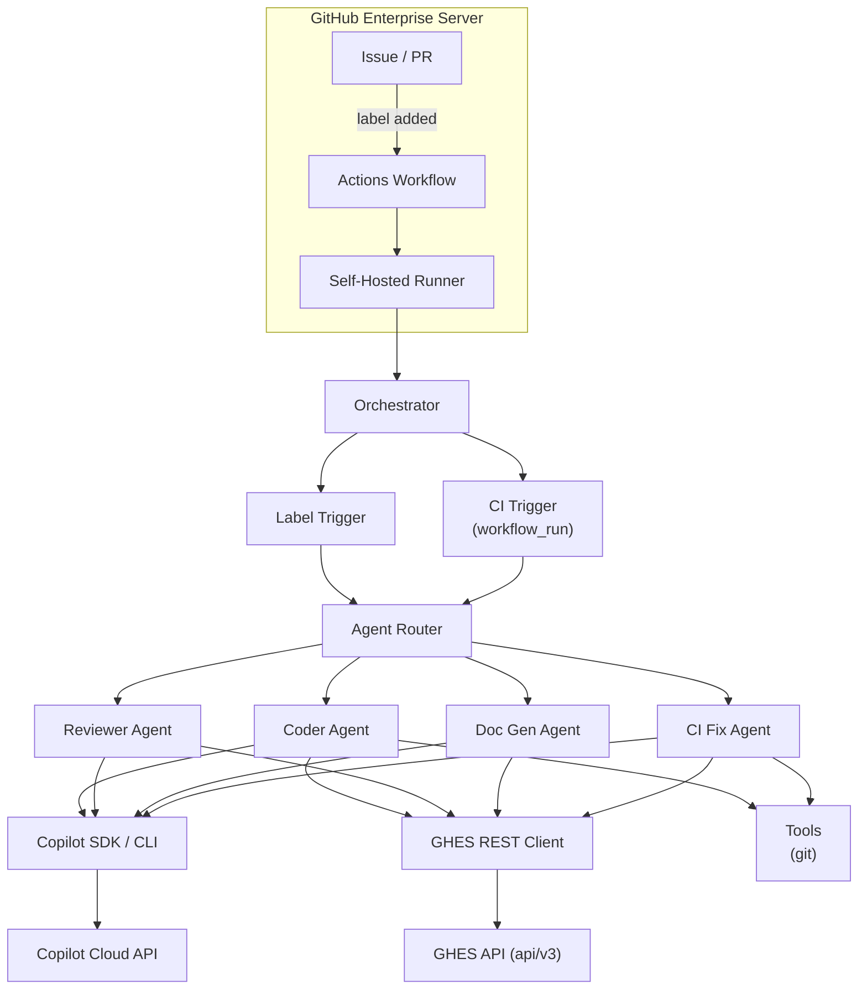

# Copilot SDK sample — Coding-agent-ish implementation on GHES 

> **This project is not an official feature of GitHub or GitHub Enterprise Server.**
> It is an example project demonstrating how to build an autonomous coding agent on GHES using the [Copilot SDK](https://github.com/github/copilot-sdk). Thorough review and testing are recommended before applying to production environments.

[](https://www.python.org/downloads/)
[](../LICENSE)


> **An autonomous coding agent that runs on GitHub Enterprise Server**
>
> Provides the same experience as the github.com Copilot coding agent in GHES environments.
> Simply add a label to an issue or PR, and the AI will analyze, implement code, and create a PR.

---

## Features

| Feature | Description | Trigger |
|---------|-------------|---------|
| **Coder Agent** | Analyzes issues, implements code, creates PRs, and drafts PR summaries with a lightweight model | `copilot` label |
| **Multi-Model Reviewer** | Same-condition multi-model cross-check with inline Suggested Changes | `copilot-review` label |
| **Doc Generator** | Updates docs from PR changed-file anchors or a workspace-wide pass | `copilot-docs` label |
| **CI Fix Agent** | Diagnoses and fixes CI failures | `copilot-fix` label / automatic on CI failure in `copilot/` branches |

### Iterative Review Loop

```
Add copilot-review label to PR
    |
Claude + GPT-5.4 run full-scope independent reviews under the same conditions
    |
Individual reviews + agreement/disagreement summary + inline Suggested Changes posted
    |
Developer: apply suggestions, then re-add copilot-review label
    |
Load previous review context -> re-review focusing on unresolved items
```

**Key capabilities:**
- **GitHub Suggested Changes**: Apply code fixes directly via the "Apply suggestion" button on the PR
- **Context chaining**: Automatically saves/loads previous review summaries to maintain consistency across re-reviews
- **Project review rules**: Define team-specific review rules in `.github/review-instructions.md`

---

## Quick Start

### 1. Set up the central repository

```bash
# Clone the GitHub.com source repository, then push it to your GHES central repository
git clone https://github.com/Heegene/copilot-sdk-coding-agent-sample.git
cd copilot-sdk-coding-agent-sample
git remote set-url origin https://ghes.example.com/YOUR_GHES_ORG/copilot-sdk-coding-agent-sample.git
git push -u origin main
```

### 2. Configure secrets

Repository Settings -> Secrets and variables -> Actions:

| Secret | Required | Description |
|--------|----------|-------------|
| `GH_TOKEN` | Yes | GHES PAT (`repo` scope; add `workflow` only when needed) -- GHES API and git authentication |
| `COPILOT_GITHUB_TOKEN` | No | GitHub token for Copilot SDK authentication. Falls back to the runner's `copilot login` credentials if not set |

### Authentication Model

The GHES API and Copilot SDK can use **separate credentials**:

| Scenario | Required Secrets | Description |
|----------|-----------------|-------------|
| **Separate Copilot auth** | `GH_TOKEN` + `COPILOT_GITHUB_TOKEN` | Inject both the GHES API token and the Copilot SDK token as secrets |
| **Pre-authenticated runner** | `GH_TOKEN` only | Runner pre-authenticated via `copilot login` |

> `COPILOT_GITHUB_TOKEN` is the **official** environment variable for the Copilot SDK (highest priority).
> If not set, the SDK/CLI must use credentials stored by `copilot login` on the runner. `GH_TOKEN` is only for GHES API and git authentication.

### Token Provisioning Guide

#### A. `GH_TOKEN` -- GHES Instance PAT

This token is used to access the GHES API (issues, PRs, git operations, etc.).

1. Navigate to your GHES instance: `https://ghes.example.com/settings/tokens`
2. **Generate new token** -> Select **Classic** (Classic PAT is recommended for GHES)
3. Select the required scopes:

   | Scope | Required | Purpose |
   |-------|----------|---------|
   | `repo` | Yes | Repository read/write, PR creation |
    | `workflow` | Conditional | Required when creating or updating `.github/workflows/*` files, such as during deployment. Not required for normal agent runtime |

4. After generating the token, store it as `GH_TOKEN` in the GHES repository secrets

#### B. `COPILOT_GITHUB_TOKEN` -- Copilot SDK Authentication (Optional)

This token allows the Copilot SDK/CLI to access AI models.
**It must be issued from a user account that has a Copilot license.**

> **Classic PATs (`ghp_`) are not supported.** The Copilot SDK only supports Fine-grained PATs (`github_pat_`) or OAuth tokens (`gho_`, `ghu_`).

**How to issue a Fine-grained PAT:**

1. Navigate to **GitHub.com** (not GHES): `https://github.com/settings/personal-access-tokens/new`
2. **Token name**: e.g., `ghes-copilot-agent`
3. **Expiration**: Set an appropriate expiration period (90 days recommended for security)
4. **Repository access**: `Public repositories (read-only)` or the minimum scope required
5. **Permissions** configuration:

   | Permission | Access | Required | Purpose |
   |------------|--------|----------|---------|
   | **Copilot** | `Read` | Yes | Copilot API requests (model invocations) |
   | **Contents** | `Read` | No | Code context analysis (optional) |

6. **Generate token** -> Copy the token starting with `github_pat_`
7. Store it as `COPILOT_GITHUB_TOKEN` in the GHES repository secrets

**Supported token types:**

| Token Prefix | Type | Copilot Support |
|-------------|------|-----------------|
| `github_pat_` | Fine-grained PAT | Supported (recommended) |
| `gho_` | OAuth user access token | Supported |
| `ghu_` | GitHub App user token | Supported |
| `ghp_` | Classic PAT | **Not supported** |

**Alternative: `copilot login` (Runner pre-authentication)**

```bash
# Run once on the self-hosted runner
copilot login
# Authenticate via GitHub OAuth in the browser -> credentials stored in system keychain
```

**SDK authentication priority ([official documentation](https://github.com/github/copilot-sdk/blob/main/docs/auth/index.md)):**

```
1. Explicit github_token (passed directly in code)
2. COPILOT_GITHUB_TOKEN environment variable
3. GH_TOKEN environment variable
4. GITHUB_TOKEN environment variable
5. OAuth credentials stored via copilot login
6. Credentials stored via gh auth login
```

### 3. Runner setup

```bash
sudo ./scripts/setup-runner.sh
```

### 4. Deploy to target repositories

```bash
# Caller mode (requires reusable workflow access permission at the org level)
./scripts/deploy-to-repo.sh ghes.example.com YOUR_GHES_ORG target-repo "$GH_TOKEN" copilot-sdk-coding-agent-sample

# Standalone mode (no cross-repo configuration required, recommended)
./scripts/deploy-to-repo.sh ghes.example.com YOUR_GHES_ORG target-repo "$GH_TOKEN" copilot-sdk-coding-agent-sample --standalone
```

> **Caller vs Standalone**: Caller mode references the central repository's workflow, so updates are automatically propagated.
> Standalone mode copies the workflow directly, so it works without any GHES org configuration changes.
> To use Caller mode, you must enable "Accessible from repositories in the organization" under the central repository's Settings -> Actions -> General -> Access.

### 5. Test it!

1. Create an issue in the target repository
2. Add the `copilot` label
3. The AI creates a PR!

> Detailed setup guide: [docs/SETUP.en.md](SETUP.en.md)

---

## Architecture



> Detailed architecture: [docs/ARCHITECTURE.en.md](ARCHITECTURE.en.md)

---

## Trigger Reference

### Label Triggers

| Label | Target | Agent | Action |
|-------|--------|-------|--------|
| `copilot` | Issue | Coder | Analyze issue -> generate code -> create PR |
| `copilot-review` | PR | Reviewer | Multi-model code review |
| `copilot-docs` | Issue/PR | Doc Gen | Update PR-related docs or run a repository-wide docs pass |
| `copilot-fix` | Issue/PR | CI Fix | Diagnose and fix CI failures |

### Auto Triggers

| Condition | Agent | Action |
|-----------|-------|--------|
| CI failure on `copilot/` branch | CI Fix | Analyze failure logs -> auto-commit fix |

---

## Multi-Model Review

Two AI models review the full PR independently with the same diff, changed-file anchors, file context, and review rubric. Changed files are the starting point, and the models can use Copilot workspace tools to inspect related callers, tests, configuration, docs, and public API boundaries. Each model gets a different emphasis area, but neither model is limited to that specialty. The summary step deduplicates findings and analyzes agreement or disagreement:

```
Add copilot-review label to PR
         |
         |-->  Claude: full-scope review + security/architecture/maintainability emphasis
         |
         |-->  GPT-5.4: full-scope review + bugs/performance/edge-case emphasis
         |
         |-->  Consolidated summary (dedupe, agreement/disagreement, final verdict)
         |
            |-->  Inline Suggested Changes
                (directly apply via "Apply suggestion" on valid PR diff lines)
```

**On re-review**: Re-adding the `copilot-review` label automatically loads the previous review context and focuses the review on unresolved items.

---

## Configuration Reference

All settings are managed via environment variables or a `.env` file.

### GHES Connection

| Environment Variable | Default | Description |
|---------------------|---------|-------------|
| `GITHUB_SERVER_URL` | `https://github.com` | GHES instance URL |
| `GH_TOKEN` | -- | GHES PAT (GHES API and git authentication) |
| `COPILOT_GITHUB_TOKEN` | -- (optional) | Token for Copilot SDK authentication |

### Copilot Settings

| Environment Variable | Default | Description |
|---------------------|---------|-------------|
| `COPILOT_CODER_MODEL` | `claude-sonnet-4.6` | Code generation model |
| `COPILOT_CODER_PR_SUMMARY_MODEL` | `gpt-5.4-mini` | Lightweight model used to summarize generated PR bodies |
| `COPILOT_REVIEWER_MODELS` | `claude-opus-4.6,gpt-5.4` | Reviewer models (comma-separated) |
| `COPILOT_REVIEWER_SUMMARY_MODEL` | first reviewer model | Model that synthesizes multi-model review findings |
| `COPILOT_REVIEWER_SUGGESTION_MODEL` | summary model | Model that formats accepted findings as inline Suggested Changes |
| `COPILOT_CLI_VERSION` | `latest` | Copilot CLI version |

### Agent Behavior

| Environment Variable | Default | Description |
|---------------------|---------|-------------|
| `AGENT_TIMEOUT_MINUTES` | `30` | Maximum agent execution time |
| `AGENT_MAX_RETRIES` | `3` | Number of retries |
| `AGENT_BRANCH_PREFIX` | `copilot/` | Prefix for created branches |
| `AGENT_DEFAULT_BRANCH` | `main` | Base branch name for PR creation |

### Concurrency Control

| Setting | Value | Description |
|---------|-------|-------------|
| `MAX_CONCURRENT_SESSIONS` | `5` (code constant) | Limits the number of concurrent Copilot API sessions within a single process (`agent/copilot_session.py`) |
| Actions concurrency group | Per workflow | Prevents duplicate workflow runs for the same issue/PR |

---

## Project Structure

```
copilot-sdk-coding-agent-sample/
├── agent/                      # Main agent package
│   ├── orchestrator.py         # Entry point, event router
│   ├── config.py               # pydantic-settings configuration
│   ├── copilot_session.py      # Copilot SDK/CLI session management
│   ├── ghes_client.py          # GHES REST API client
│   ├── agents/                 # Agent implementations
│   │   ├── coder_agent.py      # Coder agent
│   │   ├── reviewer_agent.py   # Reviewer agent (multi-model + suggestions)
│   │   ├── ci_fix_agent.py     # CI fix agent
│   │   └── doc_gen_agent.py    # Documentation generation agent
│   ├── triggers/               # Trigger handlers
│   │   └── label_trigger.py    # Label-based trigger
│   ├── tools/                  # Agent tools
│   │   └── git_tools.py        # Git operations (async subprocess)
│   └── utils/                  # Utilities
│       ├── prompts.py          # Jinja2 prompt templates
│       └── suggestions.py      # GitHub Suggested Changes formatter
├── scripts/                    # Deployment and setup scripts
│   ├── setup-runner.sh         # Runner environment setup (Python, Node, Copilot CLI)
│   ├── deploy-to-repo.sh       # Workflow deployment (Bash, --standalone support)
│   └── deploy-to-repo.ps1      # Workflow deployment (PowerShell)
├── docs/                       # Documentation
│   ├── SETUP.md                # Setup guide
│   └── ARCHITECTURE.md         # Architecture document
├── tests/                      # pytest tests
├── .github/
│   ├── workflows/              # GitHub Actions workflows
│   │   ├── copilot-coder-master.yml      # Coder agent (master)
│   │   ├── copilot-coder.yml             # Coder agent (caller)
│   │   ├── copilot-reviewer-master.yml   # Reviewer agent (master)
│   │   ├── copilot-reviewer.yml          # Reviewer agent (caller)
│   │   ├── copilot-docs-master.yml       # Documentation agent (master)
│   │   ├── copilot-docs.yml              # Documentation agent (caller)
│   │   ├── ci-fix-master.yml             # CI fix agent (master)
│   │   └── ci-fix.yml                    # CI fix agent (caller)
│   ├── copilot-instructions.md # Copilot coding rules
│   └── review-instructions.md  # Project review rules
├── AGENTS.md                   # GitHub Copilot/agent working guide
├── pyproject.toml              # Python project configuration
└── requirements.txt            # Python dependencies
```

---

## Deployment

| Step | Description | Method |
|------|-------------|--------|
| 1 | Create central repository | Clone this repo to GHES |
| 2 | Configure secrets | `GH_TOKEN` + optional `COPILOT_GITHUB_TOKEN` |
| 3 | Runner setup | `sudo ./scripts/setup-runner.sh` |
| 4 | Deploy to target repos | `./scripts/deploy-to-repo.sh ... [--standalone]` |
| 5 | (Caller mode only) Org settings | Enable access under central repo Settings -> Actions -> Access |
| 6 | Test | Create issue + add `copilot` label |

> Full deployment process: [docs/SETUP.en.md](SETUP.en.md)

---

## Scaling Guide

Key guidance for running the agent across many repositories.

### Runner Pool

- Prepare as many self-hosted runners as the number of concurrent agent executions needed (e.g., 50 concurrent -> 50+ runners; runners do not need to be particularly large)
- Add the `copilot-agent` label to all agent runners
- Register runners at the organization level to share them across all repositories

### Per-Repository Configuration

You can add `.github/ghes-agent.yml` to each repository to override branch, timeout, label, and other settings.
For details: [docs/SETUP.en.md](SETUP.en.md) | [docs/ARCHITECTURE.en.md](ARCHITECTURE.en.md)

---

## License

This project is licensed under the [MIT License](../LICENSE).

---

<div align="center">

[Setup Guide](SETUP.en.md) | [Architecture](ARCHITECTURE.en.md)

</div>
